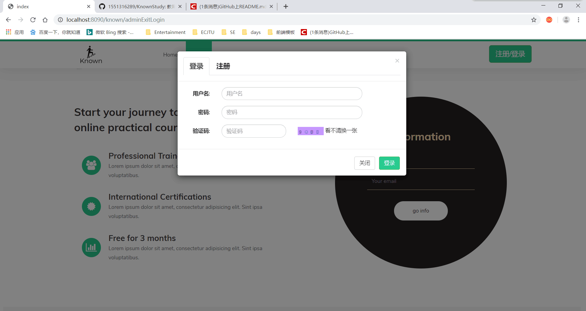
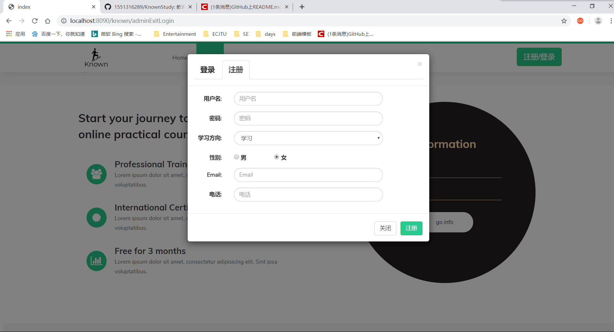
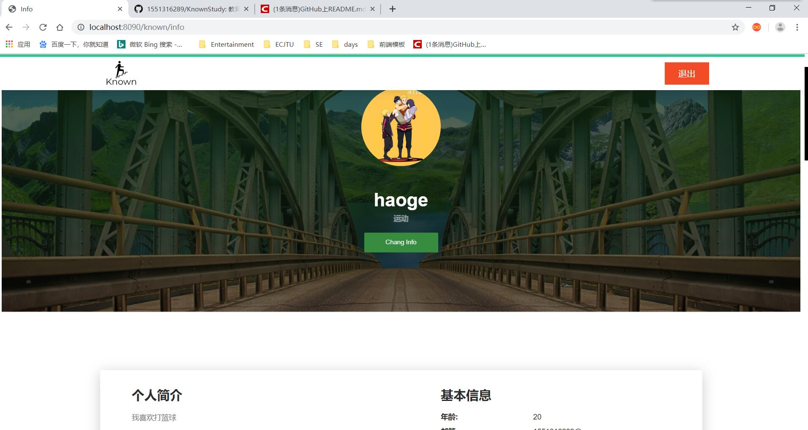
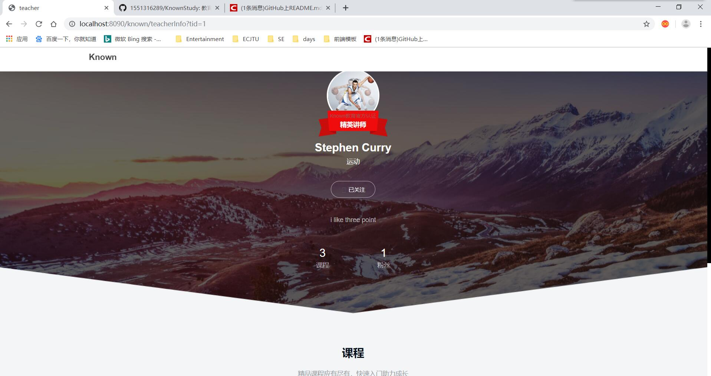
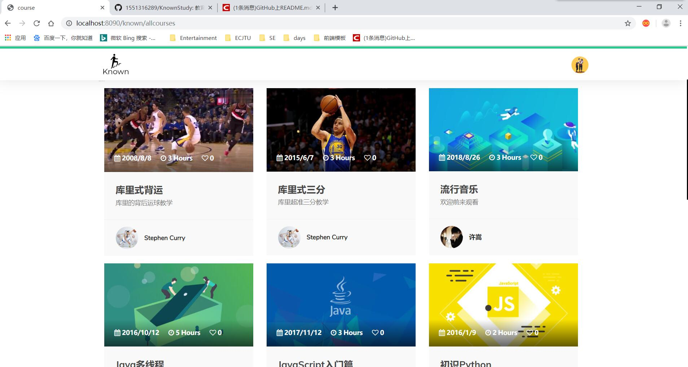
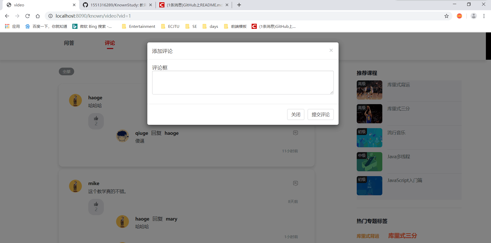
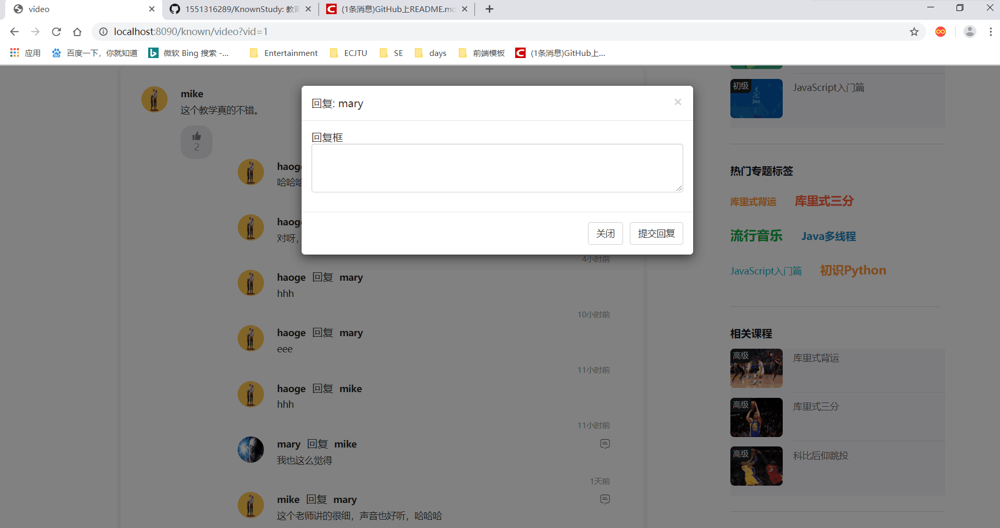
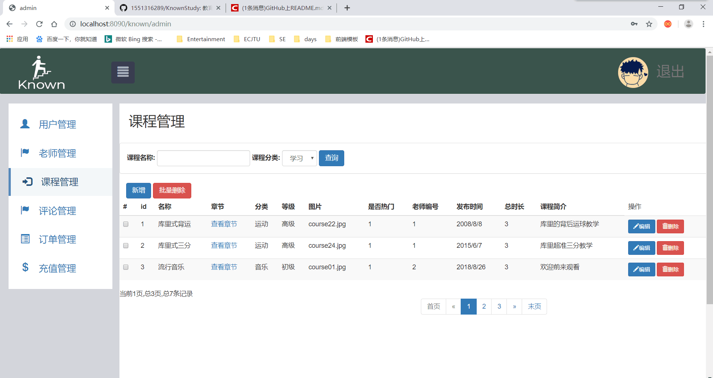

# Known在线教育网站
### 1、项目简介
开发这个Known在线教育网站是为了让更多学生可以轻松的在我们网站获取很多的学习资源，有学习方向的，比如编程视频教学，小学，中学，高中，大学的课程; 运动方向的，篮球视频教学,足球，乒乓球等等，还有其他方向的学习视频，帮助学生们拓展自己兴趣爱好，提升自己的技能。
### 2、项目模块
2.1 用户模块  
2.2 老师模块  
2.3 课程模块  
2.4 评论模块  
2.5 后台管理模块
### 3、项目技术
这个项目是基于SSM框架实现的，使用了thymeleaf模板引擎实现前后的分离，还用到了Pagehelper实现的分页功能，js动态拼接实现了评论多层回复功能。数据库使用的mysql,服务器使用的是tomcat，使用了Ajax实现的数据传递，异步刷新。
### 4、项目截图
#### 4.1项目首页

#### 4.2用户登录注册

#### 4.3用户个人信息

#### 4.4老师个人信息

#### 4.5课程展示页面

#### 4.6视频播放页面

#### 4.7视频评论页面

#### 4.8管理员后台页面

