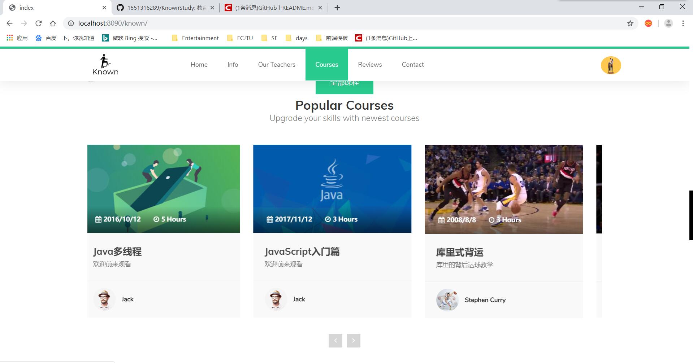
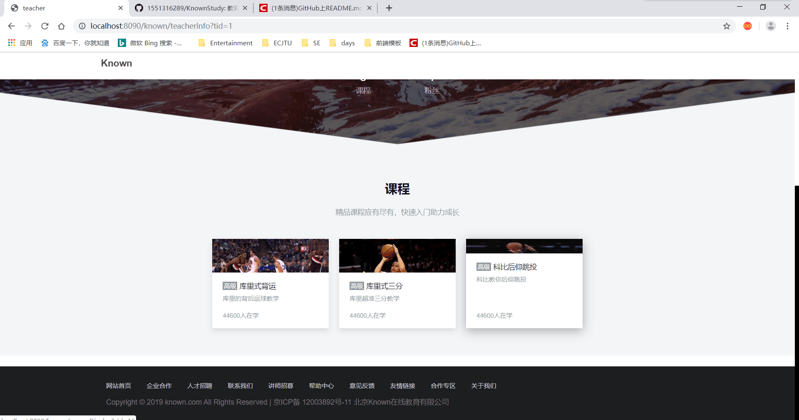

# Known在线教育网站
### 1、项目简介
毕设项目
### 2、项目模块
2.1 用户模块  
2.2 老师模块  
2.3 课程模块  
2.4 评论模块  
2.5 后台管理模块
### 3、项目技术
项目基于spring + springMvc + mybatis框架实现，html, js, jquery, bootstrap, thymeleaf
### 4、项目截图
#### 4.1项目首页

#### 4.2用户登录注册

#### 4.3用户个人信息

#### 4.4老师个人信息

#### 4.5课程展示页面

#### 4.6视频播放页面

#### 4.7视频评论页面

#### 4.8管理员后台页面

